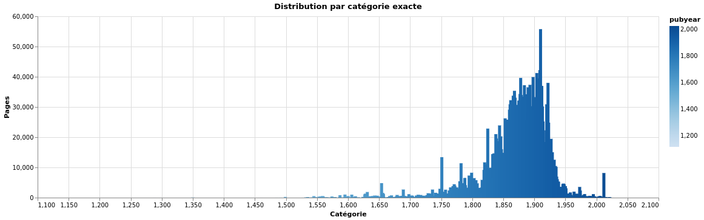
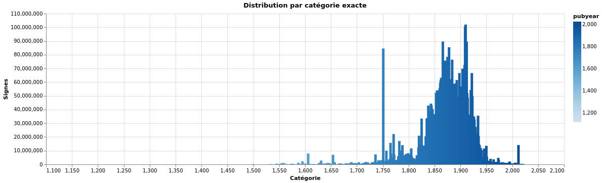
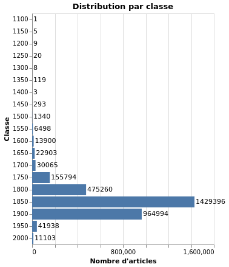
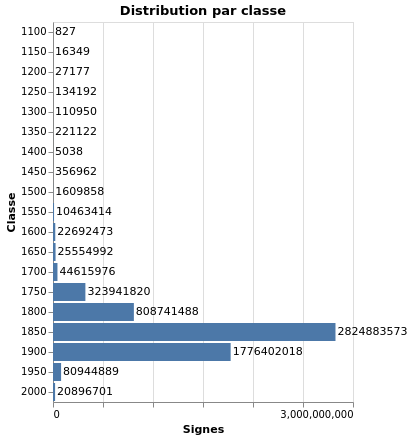

# Fouille de Texte - M1 TAL 2024/2025
# [Classification de texte par date](https://github.com/16arpi/fouille-texte-2025/)

## César Pichon ([@16arpi](https://github.com/16arpi))
## Damien Biguet ([@NiLuJe](https://github.com/NiLuJe))

TODO: ToC

----

# Objectifs

L'objectif de ce projet est de classifier des documents textuels en français par date, plus spécifiquement dans des intervalles de 50 ans. L'hypothèse étant que l'évolution de la langue française au cours du temps, tant au niveau lexical que grammatical devrait rendre possible une modélisation de ces évolutions par les algorithmes de classification étudiés en cours.

# Données & Ressources

En quête de données adaptées (du texte en français, écrit à des périodes s'étalant le plus loin possible dans l'histoire), nous avons regardé du côté de [Gallica](https://gallica.bnf.fr/accueil/fr/html/accueil-fr), [Projet Gutenberg](https://gutenberg.org/), ainsi que [Internet Archive](https://archive.org/), avant finalement de nous décider à exploiter uniquement [Wikisource FR](https://fr.wikisource.org/wiki/Wikisource:Accueil), principalement car l'intégralité du contenu est, entre autres, classé par date de publication, rendant l'exploitation de cette information idéale pour notre projet.

De plus, la fondation Wikimedia met à disposition [des copies complètes des données](https://dumps.wikimedia.org/) de ses divers wiki, ce qui nous paraissait relativement pratique: pas besoin de gérer un *scrapping* web plus ou moins hasardeux. On verra plus tard que cette approche se révélera en fait être à double tranchants (voire... à triple tranchants...).

Un autre intérêt de Wikisource est l'aspect légal non-ambigu: tout le contenu est libre, sous licence [CC-BY-SA](https://creativecommons.org/licenses/by-sa/4.0/deed.fr).

## Exploitation du dump wikisource

Nous voilà donc parti pour exploiter le *dump* du [20 mars 2025](https://dumps.wikimedia.org/frwikisource/20250320/) de Wikisource FR (spécifiquement, le fichier *frwikisource-20250320-pages-meta-current.xml.bz2*).  
Ces fichiers sont donc au format XML (selon un schéma [bien défini](https://meta.wikimedia.org/wiki/Data_dumps/Dump_format)) et compressé en BZ2. Au hasard des recherches sur les outils disponibles pour traiter ces fichiers, nous tombons sur le projet [xmltodict](https://github.com/martinblech/xmltodict): un module Python qui convertit une arborescence XML en objets natifs Python. La présentation du projet fait ressortir deux points importants pour notre utilisation: l'utilisation d'un parser XML de type SAX, donc qui ne va pas avoir besoin de charger l'intégralité du fichier en mémoire (un point relativement important vu la taille du dump: 2.3GB *compressé*); et le fait qu'il ait visiblement été testé sur des dumps Wikimedia.

Séduits par l'idée de pouvoir travailler sur des objets Python natifs et de faire outre du XML, on implémente cette passe de conversion [via un simple pipeline shell](https://github.com/16arpi/fouille-texte-2025/blob/348b7b87b2017e96a2190ef58de05eaa2b94f803/data/make_dataset.sh#L39-L43), et l'on stocke le résultat dans un fichier compressé par [zstandard](https://github.com/facebook/zstd), pour ses performances idéales (compression très correcte, et *excellentes* performances en décompression).  
Et c'est là que l'on va pour la première fois se confronter au challenge de gérer une telle quantité de données: alors que la partie parser XML travaille en *streaming*, la représentation en objets Python, elle, beaucoup moins, puisque les données s'accumulent petit à petit... Bref, on se retrouve en fin de traitement avec un joli pic d'occupation mémoire à 24GB!

## Exploration & Extraction des données

En sortie de notre pipeline `xmltodict`, on se retrouve donc avec des objets Python encodés via la bibliothèque standard [marshal](https://docs.python.org/3/library/marshal.html), dans un fichier compressé en `zstd`. On peut donc itérer sur ce fichier objet par objet, chaque objet étant en fait un dictionnaire correspondant à une page du wiki, sans avoir besoin de mettre le tout en mémoire.

On implémente donc une [boucle de lecture du flux compressé](https://github.com/16arpi/fouille-texte-2025/blob/061316cb974473dff16c25912fbc08c0b24d689e/data/extract_data.py#L309-L313) (avec une jolie barre de progression pour prendre notre mal en patience), couplé à un [générateur](https://github.com/16arpi/fouille-texte-2025/blob/061316cb974473dff16c25912fbc08c0b24d689e/data/extract_data.py#L92-L102) pour décoder l'objet.

On commence par étudier les structures de données en affichant le contenu de quelques pages via [rich.pretty.pprint](https://rich.readthedocs.io/en/stable/pretty.html) pour identifier les champs qui nous intéressent (i.e., le titre et le contenu textuel), et on vérifie la cohérence des résultats en allant explorer la version XML du dump. On isole assez facilement tout ça (c.f., [la fonction `page_extract`](https://github.com/16arpi/fouille-texte-2025/blob/061316cb974473dff16c25912fbc08c0b24d689e/data/extract_data.py#L105-L148)), mais on se rend compte assez rapidement que tout le reste des informations va se trouver dans le texte brut, qui est dans un format bien spécifique, [Wikitext](https://en.wikipedia.org/wiki/Help:Wikitext), augmenté de [conventions spécifiques à Wikisource](https://en.wikisource.org/wiki/Wikisource:Style_guide).  
Et c'est là que le deuxième effet kiss-cool de l'utilisation des dumps au lieu du contenu des pages HTML générées se fait sentir: en fait, une écrasante majorité des pages contient du contenu généré dynamiquement (via un système de *templates* assez complexe), en particulier, les pages qui contiennent les informations de catégorisation, et qui sont celles indexées et vouées à être consultées, sont quasiment *toutes* générés dynamiquement, et ne contiennent donc que le *markup* de catégorisation, et le *markup* de magie noire qui va chercher le contenu textuel ailleurs... Cet "ailleurs" se trouve en fait être des pages sous le préfixe/espace de nommage `Livre:`, qui se base sur *un* facsimilé spécifique, et comporte les informations de publication de *ce* facsimilé (informations potentiellement différentes des pages qui l'incluent, nous y reviendrons plus tard), et qui, à son tour, contient la liste de *chaque* page de cet ouvrage, sous le préfixe *Page:*, qui sont, enfin, les pages qui contiennent le contenu textuel... mais qui, malheureusement, ne contiennent *plus aucune* information de classification!  
On se retrouve donc avec plusieurs problèmes purement techniques à gérer pour démêler tout ça:

- On va avoir besoin de pouvoir exploiter le *markup* Wikitext pour pouvoir en extraire le texte brut, les informations de catégorisation, et les *templates* qui gèrent le système de génération dynamique décrit à l'instant.
- Arriver à recoller les morceaux, pour que les pages avec du contenu textuel récupèrent toutes les infos de catégorisation des pages qui les incluent.

Pour le premier point, on a testé différents parsers de Wikitext en python (c.f., [notre script d'exploration](https://github.com/16arpi/fouille-texte-2025/blob/data-report/references/wikisource_parsers_test.py)) avant de se fixer sur [wikitextparser](https://github.com/5j9/wikitextparser), principalement parce qu'il propose une gestion correcte des différents types de markup dont nous avons besoin (les *wikilinks* pour les catégories, et les *templates* pour la magie noire de génération).

Pour le deuxième point, on aurait potentiellement pu prendre l'approche inverse, c'est à dire émuler le système de *templates* pour aller chercher le contenu textuel des bonnes pages et les réintégrer à la page mère, mais comme on travaille page par page, et dans un ordre inconnu, ce n'est pas vraiment possible, puisqu'on ne peut pas aller "requêter" une autre page que celle sur laquelle on travaille (ou très éventuellement une page que l'on aurait pas encore vu si on gardait les pages en mémoire, ce qui n'aurait en plus pas été idéal pour l'utilisation mémoire du script...). On a tout de même fait quelques expériences avec [wikitextprocessor](https://github.com/tatuylonen/wikitextprocessor) pour estimer la viabilité d'une telle approche, mais l'outil semble plutôt orienté vers wiktionary (c.f., [son grand frère wiktextract](https://github.com/tatuylonen/wiktextract)): en particulier, nous n'avons pas réussi à lui faire accepter les namespaces adéquats, donc sans les pages *Livre:* et *Page:*, l'idée tombait à l'eau. Le système d'expansion des templates semblait aussi avoir des difficultés avec certaines des fonctions spécifiques à wikisource.

Bref, on va donc quand même devoir garder en mémoire un dictionnaire de catégories pour chaque page vue, afin de pouvoir les réaffecter aux bonnes pages.
Pour visualiser le problème, on peut regarder par exemple la page pour l'une des traductions de [*L'Éloge de la Folie*, d'Erasme](https://fr.wikisource.org/wiki/%C3%89loge_de_la_folie_(Nolhac)). Cette page, sans préfixe, contient la plupart des informations de catégorisation, mais aucun du texte bien visible dans la version affichée par un navigateur web! Si l'on regarde le *wikitext* de cette page, on trouve en fait uniquement ceci:
```
{{TextQuality|Textes validés}}
<pages index="Érasme - Éloge de la folie, trad de Nolhac, 1964.djvu" from=139 to=141 fromsection="éloge" tosection="éloge" header=sommaire titre="[[Éloge de la folie (Nolhac)|Éloge de la Folie]]" publication="" />

[[Catégorie:1509]]
[[Catégorie:1936]]
[[Catégorie:XVIe siècle]]
[[Catégorie:XXe siècle]]
[[Catégorie:Folie]]

[[Catégorie:Bon pour export]]
```

Il faut donc suivre cette balise *pages*, qui nous mènent à la page [*Livre:* du même nom que l'attribut `index` de cette balise](https://fr.wikisource.org/wiki/Livre:%C3%89rasme_-_%C3%89loge_de_la_folie,_trad_de_Nolhac,_1964.djvu).

Cette page est elle aussi entièrement générée grâce à du *markup* magique, et, en plus de pointer vers les différentes pages de l'ouvrage (pages sous le préfixe *Page:*, qui, elles, vont *vraiment* contenir du texte), elle contient aussi jusqu'à deux dates importantes pour notre projet: l'année d'édition et de publication originale.  
La distinction est importante, car on va trouver *beaucoup* de traductions sur wikisource, et par exemple, ici, alors que la page "principale" est classé au XVIe siècle (date de parution de la version *originale*), le texte que l'on va extraire date de 1964! On ne voudrait donc pas classer ce texte à une autre date que cette dernière. De ce fait, on appliquera en fin de chaîne une heuristique très simple qui ne garde que la date la plus récente, date qui devrait correspondre à la publication dont le texte à vraiment été extrait.

Comme on le disait plus haut, si l'on regarde [une des pages](https://fr.wikisource.org/wiki/Page:%C3%89rasme_-_%C3%89loge_de_la_folie,_trad_de_Nolhac,_1964.djvu/46) de cet ouvrage, on arrive enfin sur du contenu textuel, mais sans aucune information de catégorisation.

Bref, on a donc besoin de:

- Gérer les pages *Livre:* [pour en extraire les dates de publication](https://github.com/16arpi/fouille-texte-2025/blob/061316cb974473dff16c25912fbc08c0b24d689e/data/extract_data.py#L151-L171)
- Gérer les autres pages intéressantes (on saute en effet la plupart des namespaces) [pour extraire les information de catégorisations](https://github.com/16arpi/fouille-texte-2025/blob/061316cb974473dff16c25912fbc08c0b24d689e/data/extract_data.py#L174-L300).  
C'est aussi à cette étape que l'on extrait le texte brut en éliminant le markup (wikitextparser propose une méthode `plain_text()` qui fait le plus gros de la tâche, mais on a quand même besoin de supprimer les informations de catégorisations, puisqu'elle incluent la date que l'on cherchera à prédire. En pratique, comme on vient de le montrer, les pages avec infos de catégorisations ne contiennent *pas* de "vrai" contenu textuel, donc c'est moins problématique que les commentaires initiaux peuvent le laisser entendre).  
On applique aussi une série d'heuristiques pour filtrer les pages "vides" de contenu, soit simplement quand elles ne contiennent que [peu de caractères](https://github.com/16arpi/fouille-texte-2025/blob/061316cb974473dff16c25912fbc08c0b24d689e/data/extract_data.py#L86), soit parce qu'elles sont [générées](https://github.com/16arpi/fouille-texte-2025/blob/061316cb974473dff16c25912fbc08c0b24d689e/data/extract_data.py#L214-L229) [dynamiquement](https://github.com/16arpi/fouille-texte-2025/blob/061316cb974473dff16c25912fbc08c0b24d689e/data/extract_data.py#L235-L245) (évidemment, il y a deux types de markups différents pour implémenter la chose...).  
On utilise aussi [l'indice de qualité](https://github.com/16arpi/fouille-texte-2025/blob/061316cb974473dff16c25912fbc08c0b24d689e/data/extract_data.py#L235-L245) pour évincer les pages de mauvaise qualité (selon les contributeurs wikisource).
- Réattribuer les catégories extraites des pages "mères" (sans contenu textuel) aux pages "filles" (sans catégories): on essaye d'abord [pendant l'itération initiale](https://github.com/16arpi/fouille-texte-2025/blob/061316cb974473dff16c25912fbc08c0b24d689e/data/extract_data.py#L282-L288), en espérant qu'on ait déjà visité la page mère, mais comme cela n'est absolument pas une garantie, on a besoin d'une [deuxième passe](https://github.com/16arpi/fouille-texte-2025/blob/061316cb974473dff16c25912fbc08c0b24d689e/data/extract_data.py#L327-L344) qui refait une boucle complète sur les pages extraites.

Au même titre que pendant la conversion `xmltodict`, on arrive en fin de chaîne avec une liste de dictionnaires assez conséquente: le script requiert autour de 16GB de RAM. Et au vu du nombre assez massif de pages, la bête prend un temps assez conséquent à faire tourner (~2H30 pour la version finale). Comme il nous reste un peu de traitement à effectuer pour mettre de l'ordre dans les catégories extraites, on va stocker le tout dans une [`DataFrame`](https://github.com/16arpi/fouille-texte-2025/blob/061316cb974473dff16c25912fbc08c0b24d689e/data/extract_data.py#L346-L373), dans l'espoir que le travail sur un tel objet soit plus efficace. Cette étape utilise [pandas](https://pandas.pydata.org/), parce qu'écrite avant de voir la lumière: la suite passera par [Polars](https://pola.rs/) pour profiter de bien, bien, bien meilleures performances (tant en termes d'espace que de temps), d'une API plus expressive, et de la possibilité de travailler sur des objets sans les mettre entièrement en mémoire. Un plus non négligeable, vu qu'on obtient un tableau de 3.228 *millions* de lignes, qui occupe 2.9GB dans un fichier parquet compressé via zstd...  
Le nombre de lignes (i.e., de documents) explose par rapport au nombre d'*ouvrages* disponibles sur Wikisource, du fait que les pages ayant un vrai contenu textuel que l'on garde correspondent en fait à chaque fois à *une* page de l'ouvrage physique... On se retrouve donc avec potentiellement des centaines de lignes dans le tableau pour un seul ouvrage.

## Nettoyage final & sélection des labels de classification

### Exploration des catégories extraites

Afin d'avoir un peu plus de visibilité sur les catégories extraites, on va (essayer) de [les visualiser](https://github.com/16arpi/fouille-texte-2025/blob/061316cb974473dff16c25912fbc08c0b24d689e/fouille/plots.py#L26-L70). Au vu de la quantité de données et des différents labels utilisé sur Wikisource, le graphique est *complètement* illisible, donc je vous en fait grâce. Par contre, le listing au format CSV nous permet de mettre en lumière quelques particularités à prendre en compte:

- On devrait pouvoir simplement [extraire tout ce qui ressemble à une date](https://github.com/16arpi/fouille-texte-2025/blob/061316cb974473dff16c25912fbc08c0b24d689e/fouille/dataset.py#L39-L41) sans trop de problème (au vu des données, on peut se limiter à l'intervalle 1000-2999 pour éviter les coquilles tout en gardant notre expression régulière simple)
- Il existe une série de catégorie "Domaine public en YYYY", qui pourrait fausser nos résultats si l'on se contentait d'extraire les dates de chaque catégorie sans [évincer cette série](https://github.com/16arpi/fouille-texte-2025/blob/061316cb974473dff16c25912fbc08c0b24d689e/fouille/dataset.py#L36-L37)...
- Comme indiqué plus haut, on peut trouver *plusieurs* dates pour une même page, on veut donc [garder la plus récente](https://github.com/16arpi/fouille-texte-2025/blob/061316cb974473dff16c25912fbc08c0b24d689e/fouille/dataset.py#L48-L50), afin de gérer les traductions proprement.

Grâce à la magie des `LazyFrame` Polars, on peut donc implémenter cette passe de traitement [entièrement avec des expression Polars](https://github.com/16arpi/fouille-texte-2025/blob/061316cb974473dff16c25912fbc08c0b24d689e/fouille/dataset.py#L23-L61), et la chose tourne en quelques secondes seulement!

Comme on [évince les pages sans dates](https://github.com/16arpi/fouille-texte-2025/blob/061316cb974473dff16c25912fbc08c0b24d689e/fouille/dataset.py#L52-L53), on finit avec un tableau de 3.153 *millions* de lignes.

### Distribution par catégorie

On vient donc à l'étape précédente de rajouter une colonne `pubyear` à notre tableau, qui contient une *seule* valeur par page, on va donc pouvoir visualiser la distribution de nos documents par année de publication, afin de choisir comment l'on veut catégoriser nos données pour l'entraînement du modèle.

Si l'on regarde la distribution des *pages*, on remarque une forte concentration de documents publiés au XIXe & XXe siècle.

[](figures/clean-cats-distrib.html)

Afin de s'assurer que cette observation ne soit pas biaisée par des pages avec potentiellement peu de texte, on va aussi visualiser le nombre de *caractères* par catégories

[](figures/clean-cats-distrib-chars.html)

À part un gros pic en 1750, la distribution est sensiblement similaire, on peut donc prendre une décision finale. Pour essayer de garder un minimum de séparation à l'intérieur du "paquet" XIX-XXe, tout en essayant de ne pas trop agglutiner les catégories à beaucoup plus faible populations (XV-XVIIe), on va couper un siècle en deux, et se fixer un intervalle de 50 ans.

L'implémentation est [extrêmement triviale](https://github.com/16arpi/fouille-texte-2025/blob/061316cb974473dff16c25912fbc08c0b24d689e/fouille/dataset.py#L73-L77) en Polars (on tronque au multiple de 50 précédant), et l'on abouti aux distributions suivantes:

En nombre de pages par classe:  
[](figures/gold-cats-distrib.html)

Et en nombre de caractères par classe, pour vérifier si la forme correspond:  
[](figures/gold-cats-distrib-chars.html)

On finit avec effectivement une très faible population pour les classes < 1600, ce qui risque de ne pas aller en s'arrangeant une fois que le corpus sera partitionné...

### Partitionnement des données

Afin d'essayer de préserver ces classes minoritaires, on va procéder à un [partitionnement stratifié](https://scikit-learn.org/stable/modules/cross_validation.html#stratification), via le module [polars_splitters](https://github.com/machml/polars_splitters).

On suit le schéma classique [train/dev/test à 80/10/10](https://github.com/16arpi/fouille-texte-2025/blob/061316cb974473dff16c25912fbc08c0b24d689e/fouille/dataset.py#L86-L123), en se permettant une petite entorse: au vu des quantités massives de données, on ne va garder que 15% du dev pour faciliter et accélérer l'itération pendant le développement.

En observant les petites partitions, on remarque que, comme on s'y attendait, les classes à très faible populations ont disparues de notre jeu de données, donc les résultats ne seront cohérents que sur une partie des classes, celles qui restaient dans le sous-corpus d'entraînement.

--

Nous voilà arrivé au bout de la chaîne de traitement des données! L'implémentation a été effectuée par Damien; César s'est concentré sur la classification et l'évaluation, que nous allons maintenant aborder.

# Prérequis
## Mise en place du dépôt

Le [dépôt](https://github.com/16arpi/fouille-texte-2025) à été initialisé selon un patron [cookiecutter data science](https://cookiecutter-data-science.drivendata.org/), on va donc profiter du Makefile pour nous faciliter la vie:

- Les scripts ont été testés sous Python 3.12, le Makefile s'attend donc à trouver un exécutable `python3.12` dans le `PATH`.
- Certains des paquets nécessaires ayant des contraintes de dépendances folkloriques, il est fortement peu recommandé d'essayer d'innover sur la manière de créer l'environnement virtuel et d'installer les dépendances, ainsi:
- Pour créer l'environnement virtuel, tapez `make create_environment`, et suivez les instructions pour l'activer (comme d'habitude, `source .venv/bin/activate`).
- Tapez `make requirements` pour installer les paquets nécessaires. En cas de problème, le fichier `frozen-requirements.txt` liste des dépendances *fixes*, mais il ne devait idéalement pas être nécessaire!

## Gestion des données

Le volume des données utilisées étant assez conséquent, elles sont toutes stockées sur un bucket S3 auquel nous avons tous les deux accès. Afin de faciliter la reproductibilité des expériences, les sous-corpus finaux sont aussi disponibles publiquement, et peuvent être téléchargés via `make download_data`.

Sinon, pour les reproduire de A à Z, le pipeline d'extraction et de traitement des données est le suivant:

```bash
## Téléchargement & XML -> dict (data/make_dataset.sh)
# Nécéssite ~24GB de RAM, mais ne devrait prendre qu'une poignée de minutes.
make make_raw_dataset

## Extraction des données (data/extract_data.py)
# Nécessite ~16GB de RAM, et va prendre *au mieux* 2H30!
make extract_data

## Traitement des catégories et création des classes finales (fouille/dataset.py)
# Nécessite moins de 8GB de RAM, et devrait prendre moins d'une minute.
make data
```

Chaque étape créé une copie des données, donc on arrive assez facilement à presque ~20GB de stockage occupé en fin de chaîne, c'est potentiellement aussi un facteur à prendre en compte.

(Je travaille sur un tmpfs pour évacuer tout problème de performances I/O, mais forcément ça implique potentiellement encore plus de contraintes sur la pression mémoire, donc YMMV sur une machine avec < 48GB de RAM).

# Expériences

# Résultats


